# Technical pre-requirements
### Install Python on your laptop:
* Download Python 3.8.0 (32-bit version) using this link https://www.python.org/ftp/python/3.8.0/python-3.8.0.exe
* Save File

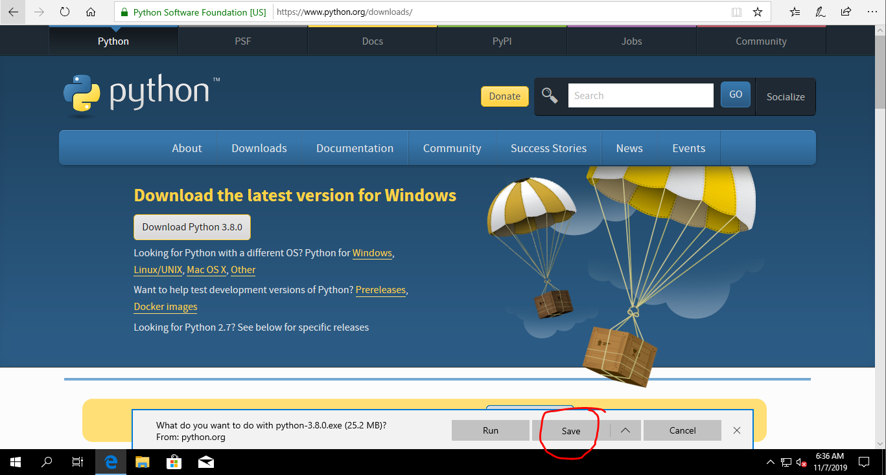

* Run downloaded file and check boxes like on image below:
  - [x] Install launcher for all users (recommended)
  - [x] Add Python 3.8 to PATH

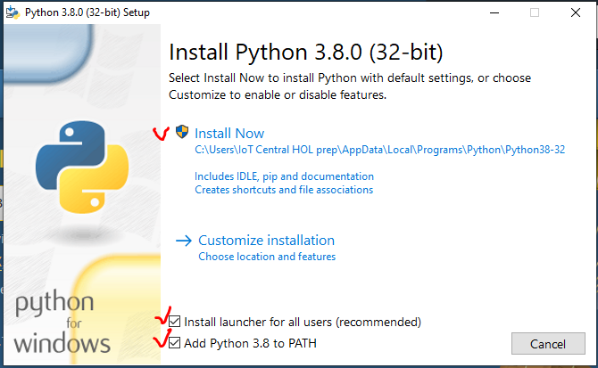

* Click on text **Disable path length limit** on Setup was successful message

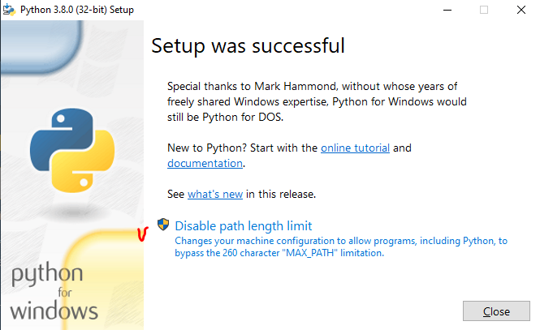

* Agree with User Account Control request - click Yes

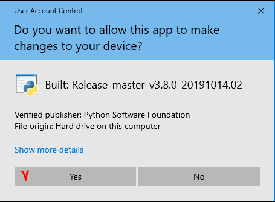

* Click Close button.

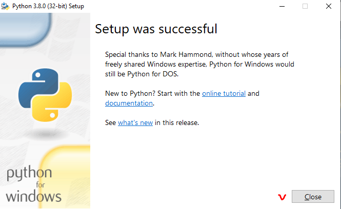

### Check Python version
Open **Command Prompt** (Win+R -> Enter), type `python --version` text and push Enter 
You should see **Python 3.8.0** is everythin done correct.

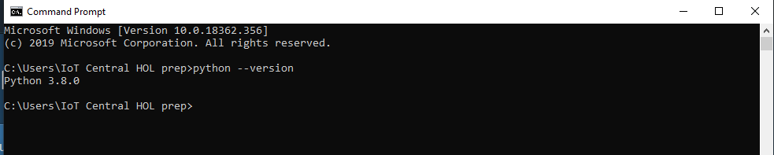

### Install IOTC libriary (iot central python client)
In Command Promt type  `pip install iotc` and push Enter. You should see downloading progress bars and finall message should like this `Successfully installed httplib2-0.14.0, iotc-0.3.5 paho-mqtt-1.5.0`. Please note, that versions may very.

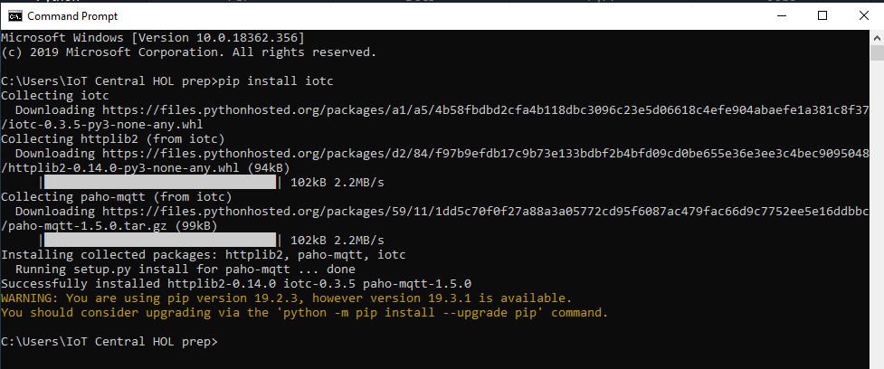

### Install VS Code 
(not mandatory, but it is much easier for eyes to work in VS code vs Python IDLE)
* Download VS Code using this link https://aka.ms/win32-x64-user-stable
* Save file on you PC and run it then.
* Agree with Terms and Conditions and click `Next` button

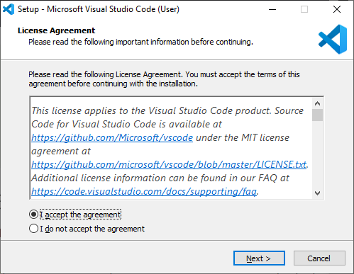

* Click `Next` button
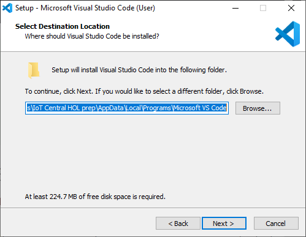

* Click `Next` button
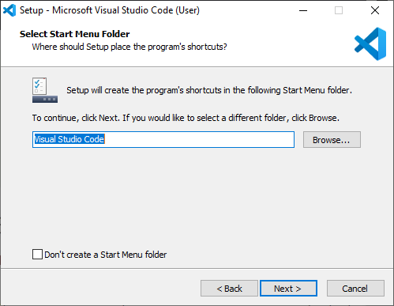

* Click `Next` button
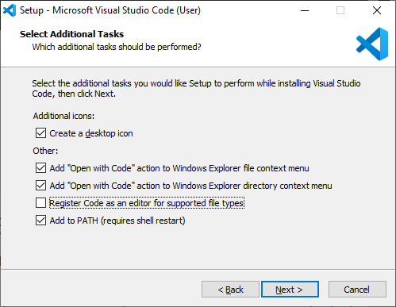

***Congratulation! Now your PC ready for HOL!***
