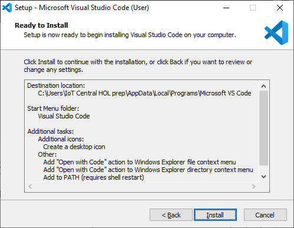
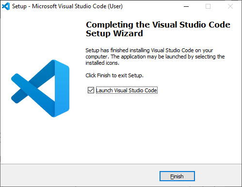
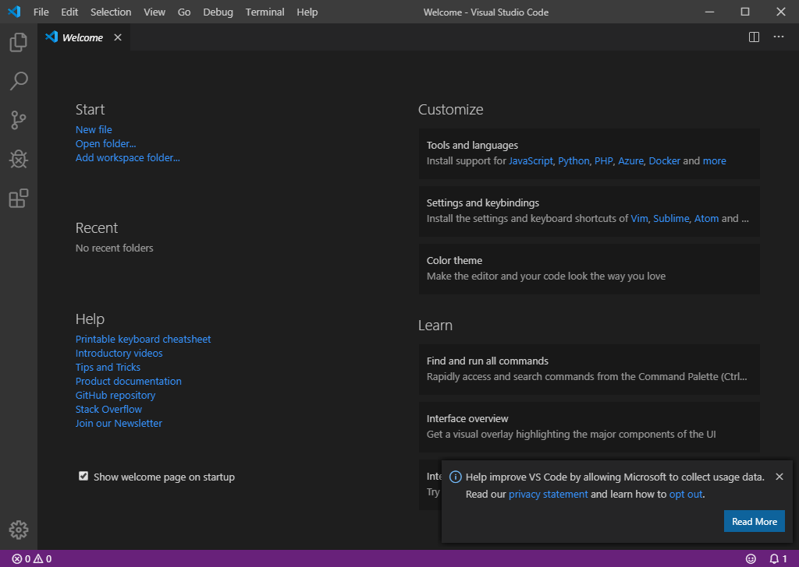
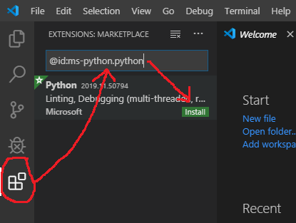
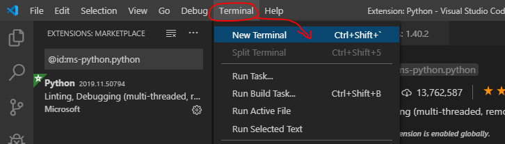
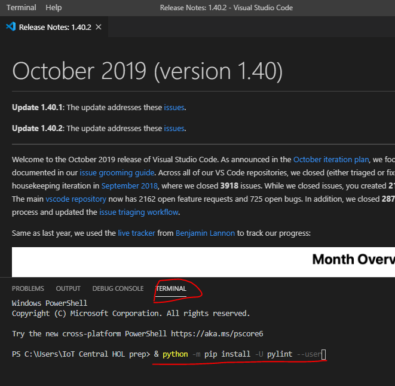

# Technical pre-requirements
### Prepare your laptop
* [install Python](#install-python)
* install IOTC client
* install Visual Studio Code
* prepapre VS Code for work with Python

(#install-python)### Install Python on your laptop:
* Download Python 3.8.0 (32-bit version) using this link https://www.python.org/ftp/python/3.8.0/python-3.8.0.exe
* Save File

* Run downloaded file and check boxes like on image below:
  - [x] Install launcher for all users (recommended)
  - [x] Add Python 3.8 to PATH

* Click on text **Disable path length limit** on Setup was successful message

* Agree with User Account Control request - click Yes

* Click Close button.

### Check Python version
Open **Command Prompt** (Win+R -> Enter), type `python --version` text and push Enter 
You should see **Python 3.8.0** is everythin done correct.

### Install IOTC libriary (iot central python client)
In Command Promt type  `pip install iotc` and push Enter. You should see downloading progress bars and final message should look like this `Successfully installed httplib2-0.14.0, iotc-0.3.5 paho-mqtt-1.5.0`. Please note, that versions of libriaris/packages may be different.

### Install VS Code 
(not mandatory, but it is much easier for eyes to work in VS code vs Python IDLE)
* Download VS Code using this link https://aka.ms/win32-x64-user-stable
* Save file on you PC and run it then.
* Agree with Terms and Conditions and click `Next` button

* Click `Next` button

* Click `Next` button

* [x] Check "Create a desktop icon"
* [x] Check "Open with Code" action to Windows Explorer file context menu"
* [x] Check "Open with Code" action to Windows Explorer directiry context menu"
* [x] Check "Add to PATH (requiers shell restart)"
- Then "Click `Next` button

* Click `Install` button

* [x] Check "Launch Visual Studio Code"
* Click `Finish` button

You should see VS Code start window like on image below.

Now you need to install two extentions that will help VS Code to understand and run Python Apps.
1. Install Python extentision from Microsoft. To do this:
  - Go to Extension Menu and put in search window text `@id:ms-python.python`, then click `Install`
 
 
 
   - Then Click on `Terminal` and `New Terminal` on VS Code main window
 
   
   
   - Put text `& python -m pip install -U pylint --user` in Teminal window and push `Enter`
   
 

***Congratulation! Now your PC ready for HOL!***
